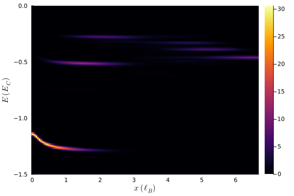

# STMTools.jl

`STMTools.jl` is a Julia package for modelling scanning tunnelling microscopy
(STM) experiments in quantum Hall systems.


## Installation

Install `STMTools.jl` directly from its Git repository into the currently
active Julia environment:

```julia
import Pkg
Pkg.add(url="https://github.com/cristivoinea/STMTools.jl.git")
```

Once installed, the package can be loaded from any Julia session using that
environment:

```julia
using STMTools
```


## Basic use

The following example computes the STM extraction spectrum for a Laughlin state with 5 particles and 3 additional quasiparticles. First, one needs to define the setup, including the tunneling direction (bias), impurity charge, and gate/impurity/tip distance from the sample.

```julia
using STMTools, Plots

ne = 5
nbr_qp = 3
charge_qp = 1//3
nm = 3*ne - 2 -nbr_qp

bias = -1
impurity_charge = -1.
d_i = 0.
d_g = 7.
nbr_g = 1.
d_t  = 0.2
rpa = true
field = 0.

width = 0.01
enrg_res = 0.01
phi = pi/2
thetas = 0:0.01:pi
```

The interaction pseudopotentials and the one-body potentials from the impurity, tip, and linear field need to be retrieved first:
```
```

The LDOS can now be computed and visualised:
```
enrg_range, dist_range, ldos = ldos_anisotropic(
    ne, nm, bias, thetas, phi,
    interaction_pspot, impurity_pot; tip_pot = tip_pot, field=field,
    nbr_qp=nbr_qp, charge_qp=charge_qp,
    width=width, enrg_res=enrg_res)


heatmap(dist_range, enrg_range, ldos)
```
